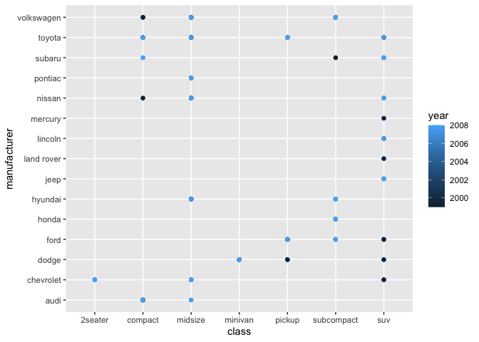

Homework 3
================

Different manufacturers produce different classes of vehicles. I want to
investigate which classes of vehicle are most widespread throughout
different manufacturers, and whether this trend has changed over time.

``` r
library(tidyverse)
```

    ## ── Attaching packages ─────────────────────────────────────── tidyverse 1.3.1 ──

    ## ✓ ggplot2 3.3.5     ✓ purrr   0.3.4
    ## ✓ tibble  3.1.4     ✓ dplyr   1.0.7
    ## ✓ tidyr   1.1.3     ✓ stringr 1.4.0
    ## ✓ readr   2.0.1     ✓ forcats 0.5.1

    ## ── Conflicts ────────────────────────────────────────── tidyverse_conflicts() ──
    ## x dplyr::filter() masks stats::filter()
    ## x dplyr::lag()    masks stats::lag()

``` r
ggplot(data = mpg) +
  geom_point(mapping = aes(x = class, y = manufacturer, color = year))
```

<!-- -->

The plot suggests that the two most universally produced classes of
vehicles are SUVs and midsize ones. The creation of midsize vehicles is
also a more recent addition to the automobile industry.
