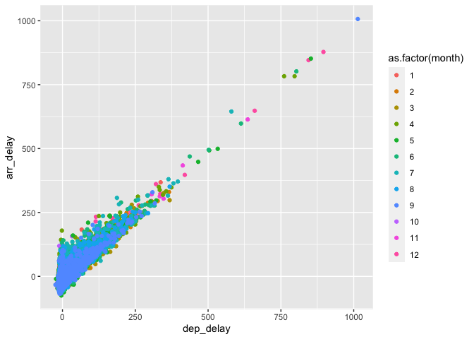

Homework 4
================

\#**Part 1** Using variables with addition

``` r
a <- 3
b <- 2

print(a + b)
```

    ## [1] 5

\#**Part 2** Using the sum function

``` r
sum(2,3)
```

    ## [1] 5

\#**Part 3** Scatterplot of arrival delay versus departure delay

``` r
####
#Script for HW4, generating plot of American Airlines arrival/departure delays
####

library(tidyverse)
library(nycflights13)

AA_flights <- filter(flights, carrier == "AA")

ggplot(data = AA_flights) +
  geom_point(mapping = aes(x = dep_delay, y = arr_delay, color = as.factor(month)))
```

<!-- -->

The data shows that most arrival and departure delays are between 0 and
500 minutes in length and that these delays are concentrated from July
to September
