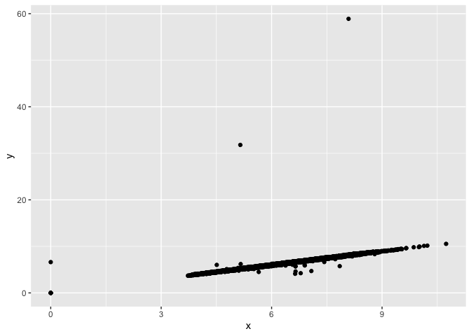
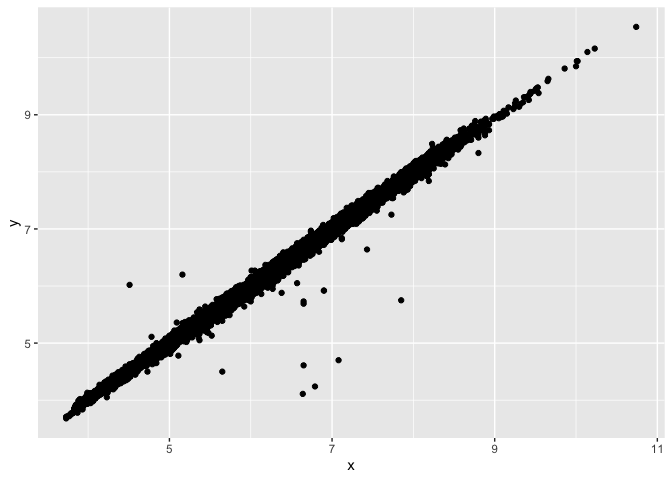
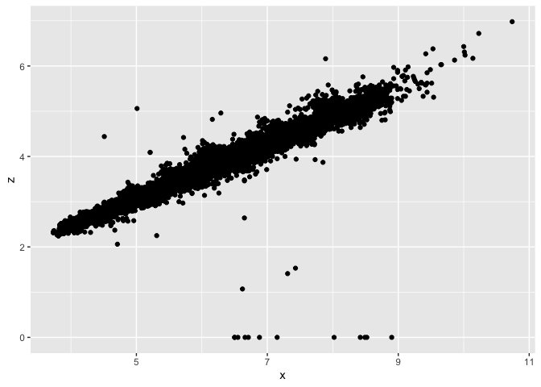

Homework 5
================

This assignment focuses on the manipulation of the *diamonds* data set,
specifically using the dplyr functions.

**Part 1**

``` r
library(tidyverse)

diamonds.cut <- diamonds %>%
  group_by(cut)

count(diamonds.cut, cut)
```

    ## # A tibble: 5 × 2
    ## # Groups:   cut [5]
    ##   cut           n
    ##   <ord>     <int>
    ## 1 Fair       1610
    ## 2 Good       4906
    ## 3 Very Good 12082
    ## 4 Premium   13791
    ## 5 Ideal     21551

``` r
###Grouping the diamonds data set by cut and then counting the number of values for each category of cut. 
```

**Part 2**

``` r
sample_frac(diamonds.cut, 0.1, replace = TRUE)
```

    ## # A tibble: 5,394 × 10
    ## # Groups:   cut [5]
    ##    carat cut   color clarity depth table price     x     y     z
    ##    <dbl> <ord> <ord> <ord>   <dbl> <dbl> <int> <dbl> <dbl> <dbl>
    ##  1  1    Fair  D     VVS1     56.7    68 10752  6.66  6.64  3.77
    ##  2  1    Fair  F     SI1      65.4    59  4798  6.27  6.2   4.08
    ##  3  0.7  Fair  D     SI2      65.5    57  1806  5.56  5.43  3.6 
    ##  4  0.7  Fair  E     SI1      64.4    53  2697  5.61  5.57  3.6 
    ##  5  1.51 Fair  G     VS1      60.8    66 12948  7.35  7.25  4.44
    ##  6  1.02 Fair  H     SI1      56.9    58  4935  6.64  6.75  3.81
    ##  7  0.7  Fair  G     SI2      65.2    56  2117  5.63  5.54  3.64
    ##  8  0.3  Fair  F     VS2      64.5    55   662  4.31  4.19  2.74
    ##  9  0.5  Fair  F     VS2      55.8    60  1279  5.31  5.27  2.95
    ## 10  1.2  Fair  I     I1       65.1    55  2376  6.65  6.59  4.31
    ## # … with 5,384 more rows

``` r
###The diamonds data set has been organized by cut and 1% of the data points have been selected at random.
```

**Part 3**

``` r
diamonds.size <- diamonds %>%
  group_by(clarity)

slice_max(diamonds.size, order_by = carat,n = 100, with_ties = FALSE) %>%
  summarise(average.size = mean(carat))
```

    ## # A tibble: 8 × 2
    ##   clarity average.size
    ##   <ord>          <dbl>
    ## 1 I1              2.51
    ## 2 SI2             2.62
    ## 3 SI1             2.30
    ## 4 VS2             2.23
    ## 5 VS1             2.10
    ## 6 VVS2            1.66
    ## 7 VVS1            1.51
    ## 8 IF              1.40

``` r
###The average size of the largest 100 diamonds in each clarity category
```

**Part 4** Plotting the length, width, and depth of each diamond

``` r
ggplot(data = diamonds.cut) +
  geom_point(mapping = aes(x = x, y = y))
```

<!-- -->

``` r
ggplot(data = diamonds.cut) +
  geom_point(mapping = aes(x = x, y = z))
```

<!-- -->

**Part 5**

Plotting the length, width, and depth of each diamond with questionable
points removed.

``` r
diamonds.organized <- diamonds %>%
  filter(x >3, y < 20, y > 1, z < 10, z > 2)

ggplot(data = diamonds.organized) +
  geom_point(mapping = aes(x = x, y = y))
```

<!-- -->

``` r
ggplot(data = diamonds.organized) +
  geom_point(mapping = aes(x = x, y = z))
```

<!-- -->
