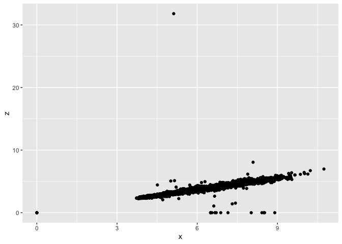
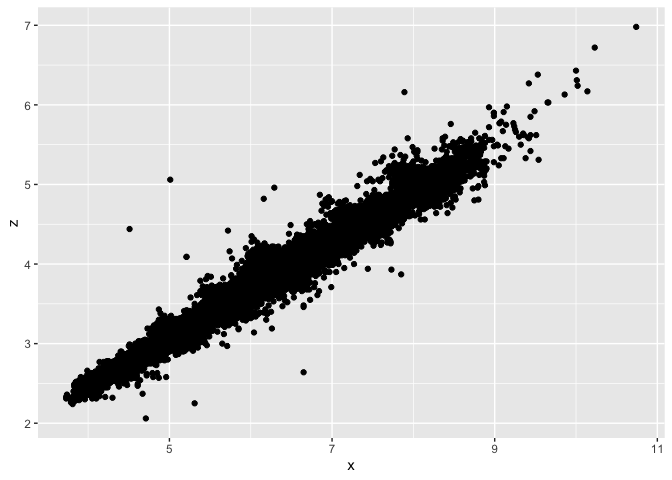

Homework 5
================

This assignment focuses on the manipulation of the *diamonds* data set,
specifically using the dplyr functions.

**Part 1**

``` r
library(tidyverse)

diamonds.cut <- diamonds %>%
  group_by(cut)

count(diamonds.cut, cut)
```

    ## # A tibble: 5 × 2
    ## # Groups:   cut [5]
    ##   cut           n
    ##   <ord>     <int>
    ## 1 Fair       1610
    ## 2 Good       4906
    ## 3 Very Good 12082
    ## 4 Premium   13791
    ## 5 Ideal     21551

``` r
###Grouping the diamonds data set by cut and then counting the number of values for each category of cut. 
```

**Part 2**

``` r
dplyr::sample_frac(diamonds.cut, 0.1, replace = TRUE)
```

    ## # A tibble: 5,394 × 10
    ## # Groups:   cut [5]
    ##    carat cut   color clarity depth table price     x     y     z
    ##    <dbl> <ord> <ord> <ord>   <dbl> <dbl> <int> <dbl> <dbl> <dbl>
    ##  1  1.05 Fair  G     VS1      65.6    58  7283  6.25  6.38  4.13
    ##  2  1.16 Fair  G     SI2      60.1    60  4307  6.9   6.72  4.09
    ##  3  1.02 Fair  F     SI1      61.8    50  4227  6.59  6.51  4.05
    ##  4  1.64 Fair  G     I1       64.5    60  4849  7.44  7.35  4.76
    ##  5  0.35 Fair  D     VVS2     53.2    62  1011  4.87  4.8   2.57
    ##  6  0.75 Fair  F     SI1      64.5    60  2363  5.65  5.54  3.61
    ##  7  0.98 Fair  H     SI2      67.9    60  2777  6.05  5.97  4.08
    ##  8  2    Fair  I     SI2      65.9    57 10833  7.96  7.79  5.19
    ##  9  1.55 Fair  H     SI2      64.6    58  9045  7.28  7.21  4.68
    ## 10  1    Fair  H     VS2      64.8    62  4861  6.22  6.13  4   
    ## # … with 5,384 more rows

``` r
###The diamonds data set has been organized by cut and 1% of the data points have been selected at random.
```

**Part 3**

``` r
diamonds.size <- diamonds %>%
  group_by(clarity)

dplyr::slice_max(diamonds.size, order_by = carat,n = 100, with_ties = FALSE) %>%
  dplyr::summarise(average.size = mean(carat))
```

    ## # A tibble: 8 × 2
    ##   clarity average.size
    ##   <ord>          <dbl>
    ## 1 I1              2.51
    ## 2 SI2             2.62
    ## 3 SI1             2.30
    ## 4 VS2             2.23
    ## 5 VS1             2.10
    ## 6 VVS2            1.66
    ## 7 VVS1            1.51
    ## 8 IF              1.40

``` r
###The average size of the largest 100 diamonds in each clarity category
```

**Part 4** Plotting the length, width, and depth of each diamond

``` r
ggplot(data = diamonds.cut) +
  geom_point(mapping = aes(x = x, y = y))
```

<!-- -->

``` r
ggplot(data = diamonds.cut) +
  geom_point(mapping = aes(x = x, y = z))
```

<!-- -->

**Part 5**

Plotting the length, width, and depth of each diamond with questionable
points removed.

``` r
diamonds.organized <- diamonds %>%
  filter(x >3, y < 20, z < 10)

ggplot(data = diamonds.organized) +
  geom_point(mapping = aes(x = x, y = y))
```

<!-- -->

``` r
ggplot(data = diamonds.organized) +
  geom_point(mapping = aes(x = x, y = z))
```

<!-- -->
