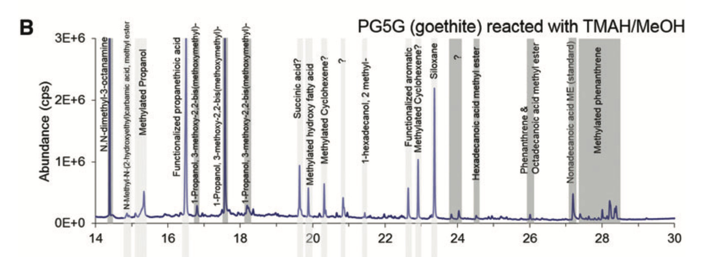
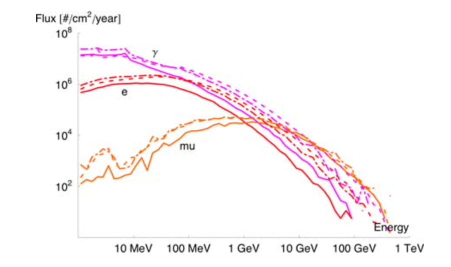

# *Good Plot*

The good plot comes from Williams et. al and focuses on the identification of fatty acids in Mars analog environments. 

The data named "Retention Time" is mapped to the x-axis.

The data named "Abundance" is mapped to the y-axis.

The data is displayed as a line graph, with peaks in abundance labeled with the a corresponsing fatty acid detected at that time. 

# *Bad Plot*

The bad plot comes from an article by Dartnell et. al which focuses on the surface and subsurface radiation environment on Mars. 

The data named "energy" is mapped to the x-axis.

The data named "Flux" is given on the y-axis.

The "flux" data is categorical, with each energy particle being assigned its own unordered color.

The data is displayed as a line graph.

The plot is an example of what Wilke would call an "ugly" plot, with some characteristics of a "bad" plot. The color choice causes the data to become muddled and difficult to discern, and the use of dashed and dot-dash lines to distinguish surface models is ineffective at highlighting any differences. 
