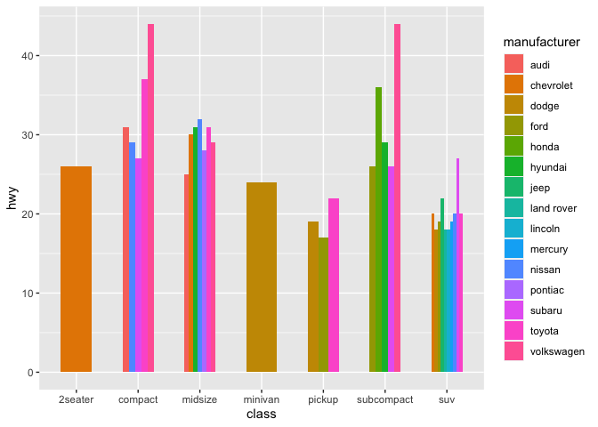

Homework 7
================

# *Bad Plot*

``` r
library(tidyverse)
```

``` r
ggplot(data = mpg, aes(x = class, y = hwy, color = manufacturer)) +
  geom_bar(stat = 'identity', width = 2)+
  geom_text(aes(label=hwy)) +
  theme(legend.position = 'none')
```

    ## Warning: position_stack requires non-overlapping x intervals

<!-- -->

This plot fails for numerous reasons as detailed by Wilke and Tufte. At
its core the plot is attempting to relate the class of vehicle to the
miles per gallon obtained on the highway. From a visual standpoint
several issues arise with the presentation: the shape of the bars, their
positions atop each other, and the color scheme. The bars are much too
thick, causing the data points for different classes to overlap and make
the plot confusing to interpret. The color scheme of the plot is
difficult to follow given that there is no legend to establish what the
colors represent. In this case, although it is not shown, the colors
represent different manufacturers, and the bars are organized in a
stacked position. This artificially increases the values of the y-axis,
misconstruing the data present. Finally, the labels attempting to
identify the value for each bar are placed at the bottom of the bars and
are overlain atop one another, making them impossible to interpret.

# *Better Plot*

``` r
ggplot(data = mpg, aes(x = class, y = hwy, fill = manufacturer)) +
  geom_bar(stat = 'identity', width = 0.5, position=position_dodge()) 
```

<!-- -->

Although not perfect, this plot does a significantly better job of
portraying the data modeled. The bars for each manufacturer are placed
aside rather than atop one another which solves the issue of the faulty
y-axis. The colors of the bars have also been adjusted to be more
distinctive as solid bars, rather than as neon lines. A legend has been
added to understand the color scheme of the plot, and the overall width
of the bars has been reduced drastically to prevent any overlapping.
