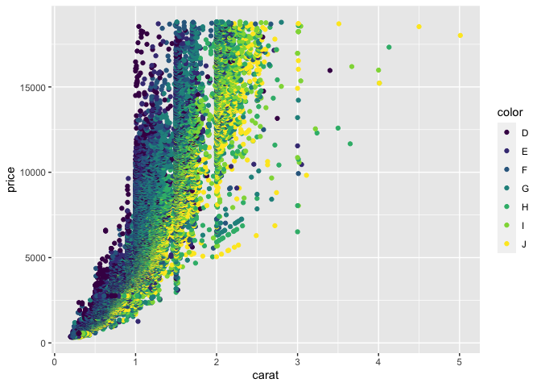
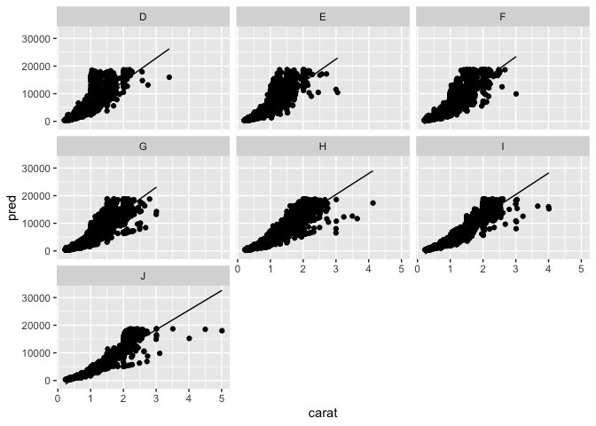
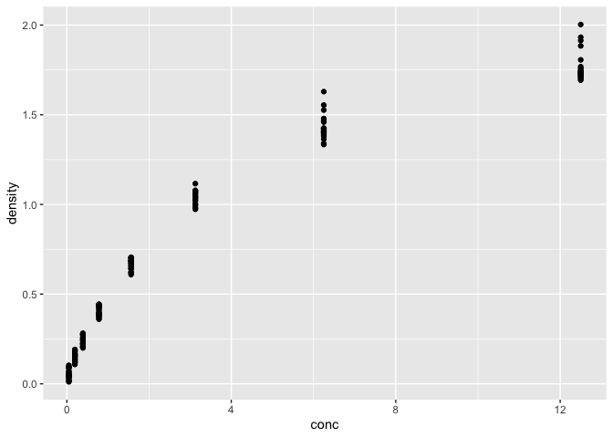
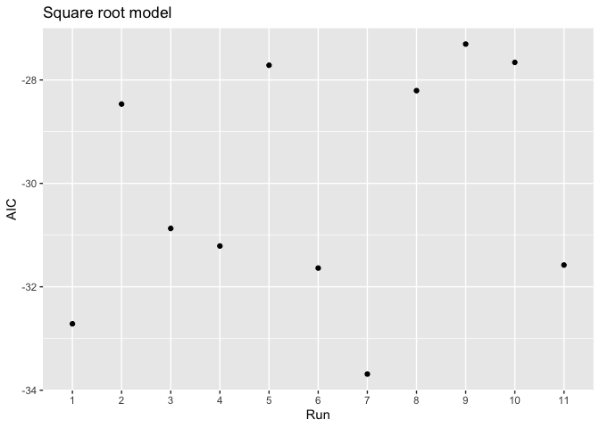
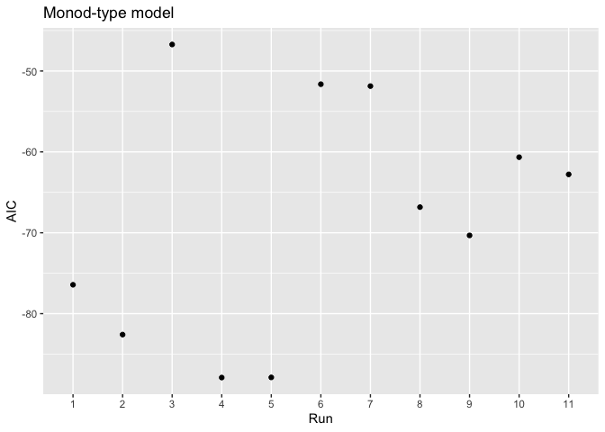

Homework 8
================

### Question 1

Plotting the relationship of price as a function of weight for each
color in order of decreasing slope for the *diamonds* data set.

``` r
library(tidyverse)
library(modelr)

ggplot(data = diamonds) +
  geom_point(aes(x=carat, y=price, color = color))
```

<!-- -->

``` r
# plotting general relationship between carat and price for the whole data set

dmd <- diamonds %>%
  group_by(color) %>%
  nest()

# grouping by color and listing the data via nest
```

``` r
color_model <- function(df)
  lm(price~carat, data = df)
# Creating the linear model and primary function df

dmd <- dmd %>%
  mutate(model = map(data, color_model))

dmd <- dmd %>%
  mutate(predicts = map2(data, model, add_predictions))

predicts <- unnest(dmd, predicts)

# unnesting the list in order to plot the data
```

``` r
ggplot(data = predicts) +
  geom_line(aes(x=carat, y=pred)) +
  geom_point(aes(x=carat, y=price)) +
  facet_wrap(~color)
```

<!-- -->

``` r
arrange(predicts, desc(color))
```

    ## # A tibble: 53,940 × 13
    ## # Groups:   color [7]
    ##    color data     model  carat cut   clarity depth table price     x     y     z
    ##    <ord> <list>   <list> <dbl> <ord> <ord>   <dbl> <dbl> <int> <dbl> <dbl> <dbl>
    ##  1 J     <tibble… <lm>    0.31 Good  SI2      63.3    58   335  4.34  4.35  2.75
    ##  2 J     <tibble… <lm>    0.24 Very… VVS2     62.8    57   336  3.94  3.96  2.48
    ##  3 J     <tibble… <lm>    0.3  Good  SI1      64      55   339  4.25  4.28  2.73
    ##  4 J     <tibble… <lm>    0.23 Ideal VS1      62.8    56   340  3.93  3.9   2.46
    ##  5 J     <tibble… <lm>    0.31 Ideal SI2      62.2    54   344  4.35  4.37  2.71
    ##  6 J     <tibble… <lm>    0.3  Good  SI1      63.4    54   351  4.23  4.29  2.7 
    ##  7 J     <tibble… <lm>    0.3  Good  SI1      63.8    56   351  4.23  4.26  2.71
    ##  8 J     <tibble… <lm>    0.3  Very… SI1      62.7    59   351  4.21  4.27  2.66
    ##  9 J     <tibble… <lm>    0.31 Very… SI1      59.4    62   353  4.39  4.43  2.62
    ## 10 J     <tibble… <lm>    0.31 Very… SI1      58.1    62   353  4.44  4.47  2.59
    ## # … with 53,930 more rows, and 1 more variable: pred <dbl>

### Question 2

Fitting nonlinear models using either a monod model or a single square
root model and comparing the effectiveness of both at displaying the
DNase data set.

``` r
library(tidyverse)

ggplot(data=DNase) +
  geom_point(aes(conc, density))
```

<!-- -->

``` r
# Showing conc and density are not related in a linear way.
```

``` r
library(nls2)
library(proto)

by_run <- DNase %>% 
  group_by(Run) %>% 
  nest()
nls_mod <- formula(density ~ beta_1 * sqrt(conc) + beta_0)
single_sqrt_model <- function(ssm) {
  nls2(nls_mod, 
  data = ssm, 
  start = list(beta_1 = 0.5, beta_0 = 0.1))
}
by_run <- by_run %>% 
  mutate(model = map(data, single_sqrt_model ))
glance <- by_run %>% 
  mutate(glance = map(model, broom::glance)) %>% 
  unnest(glance)
ggplot(glance, aes(x=Run, y=AIC)) + 
  geom_point() + 
  ggtitle("Square root model")+
 scale_x_discrete(limits=glance$Run)
```

<!-- -->

``` r
# Creating the square root model
```

``` r
by_run_2 <- DNase %>% 
  group_by(Run) %>% 
  nest()
mon_mod <- formula(density ~ beta_3*conc / (beta_4+conc))
monod_model <- function(mm) {
  nls2(mon_mod, 
  data = mm, 
  start = list(beta_3 = 2, beta_4 = 3))
}
by_run_2 <- by_run_2 %>% 
  mutate(model = map(data, monod_model ))
glance <- by_run_2 %>% 
  mutate(glance = map(model, broom::glance)) %>% 
  unnest(glance)
ggplot(glance, aes(x=Run, y=AIC)) + 
  geom_point() + 
  ggtitle("Monod-type model")+
 scale_x_discrete(limits=glance$Run)
```

<!-- -->

``` r
# Creating the monod model and defining the variables Dmax and K
```

Based on the shapes of the plots, it appears that the monod-type model
is the better of the two to display the data.
